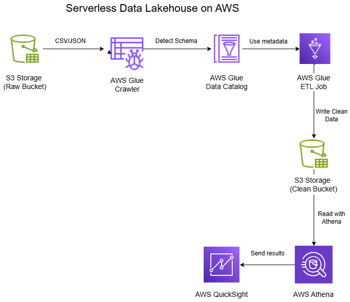
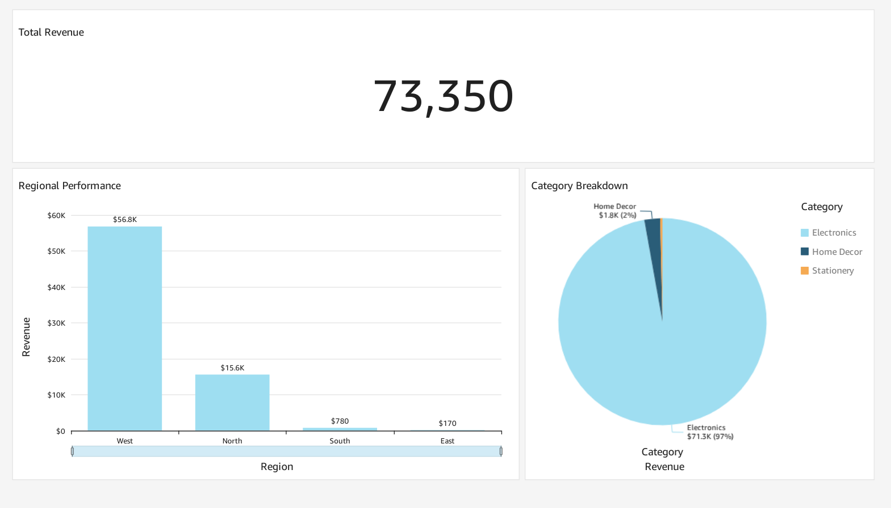

# 🧊 Serverless Data Lakehouse on AWS – E-Commerce Sales Insights

This project demonstrates a complete **serverless data lakehouse architecture** using AWS services.  
It starts from **raw data in S3** and ends with a fully functional **dashboard in QuickSight**.

---

## 📦 Use Case

Build a simplified eCommerce pipeline for the use case:
- Ingest sales data (CSV + JSON)
- Clean and transform it
- Run SQL queries
- Visualize KPIs like total sales, category-wise breakdown, and regional performance

---

## 🧱 Architecture Overview

> This follows the lakehouse pattern: raw data in a data lake (S3), transformed and queried like a warehouse, then visualized.

---

## 🛠️ Tech Stack

| Service        | Purpose                           |
|----------------|-----------------------------------|
| **Amazon S3**  | Raw & clean data storage          |
| **AWS Glue**   | Metadata crawling + ETL (PySpark) |
| **Athena**     | SQL querying from S3              |
| **QuickSight** | Dashboards & KPI visualizations   |

---

## 📁 Project Structure

| Folder            | Contents                          |
|-------------------|-----------------------------------|
| `/scripts/`       | Glue PySpark ETL job              |
| `/queries/`       | Athena SQL queries                |
| `/images/`        | Architecture + dashboard screenshots |
| `/data-samples/`  | Small sample of input data        |

---

## 📸 Dashboard Preview

---

## ✅ Key Outcomes

- Built an end-to-end serverless **data lakehouse pipeline**
- Cleaned and transformed semi-structured data using AWS Glue
- Queried S3 files using Athena
- Created an interactive dashboard in QuickSight
- All within **free tier** of AWS

---

## 🧠 What I Learned

- Practical application of Glue, Athena, and S3
- Converting messy raw data into business-ready insights
- Cost-conscious AWS resource management
- Real-world BI pipeline deployment

---

## 🔗 Connect

Want to collaborate or discuss more projects?  
Reach me at [LinkedIn](https://linkedin.com/in/mitesh-s-desai)
